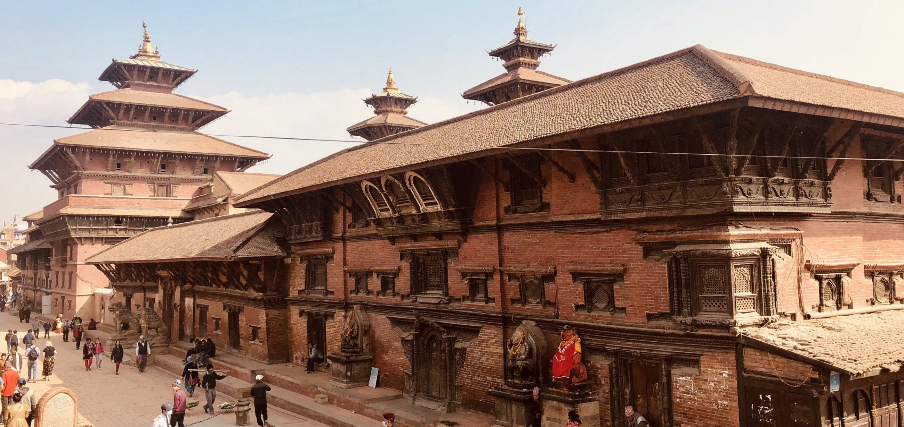
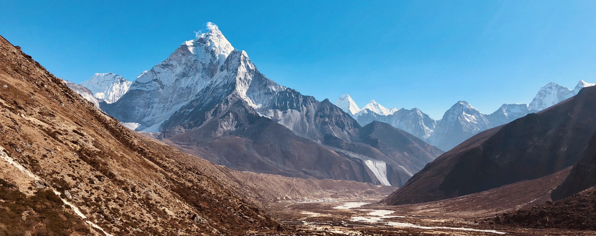

It was a once-in-a-lifetime chance, an opportunity, anyone who loves mountains would not think twice to seize.
But before we head up - to a place 'where Gods and mountains meet', let's take a walk through the streets of Kathmandu and Patan.

My first impression of Kathmandu was not a surprise, after visiting Vietnam and Cambodia the chaos, the smells, the very poignant sensory experience was expected and very welcome indeed. Landing anywhere in Asia, getting on a taxi, Tuk-Tuk or a motorbike, disappearing into the chaotic yet pleasant realm of kind people who know how to appreciate the small things in life - is that little joyful moment in life I treasure the most. That transition from an elaborately organised concrete jungle to a place where chaos seems to be the preferred way of life is thrilling but also liberating and very addictive.
After about a 45 min of a somewhat turbulent taxi ride from the only International Airport in Nepal to Thamel (the central district of Kathmandu), I have noticed the pollution here was far worse than Ho Chi Minh City or any other City I have ever visited in Asia.
The small talk on the way there was limited to the usual 'where you from my friend?'. I can not blame the driver for not being more talkative… what was happening outside was absolute road anarchy nothing like what I have seen in SouthEast Asia so far. I was grateful he chose to focus on the road rather than my entertainment and potentially lucrative tip. I was already entertained fully and terrified at the same time with what I could see outside. It's hard to describe but try to imagine finding yourself on a bustling junction or a crossroad in the middle of a busy City Centre, when suddenly everyone decides they have the right of way, you get the picture.
Thamel is where all the tourists go; it's a network of narrow streets packed with souvenir shops, restaurants, hotels and most of all branded trekking equipment of questionable source and authenticity. Everything is 'North Face' and 100% silk. Here's a little advice by the way - never openly question it, you will be proven wrong and in extreme cases firmly expelled from the shop. You don't know what 100% silk means, and they have never seen it themselves but they are running a business here, and that's what the sign says so dare not question it because you are wrong one way or the other.
My good friend from Hoi An in Vietnam who runs a little tailor empire in the ancient part of the town explained that to me once:
"See, the tourists want 100%, but that isn't the best, you need some backing material, so we have the sign saying 100% and the tourists are 100% happy"
Seems legit.

The temples, even though partially destroyed during the 2015 devastating earthquake are stunning and worth every minute of your time. The restoration is underway so there will be scaffolding and works happening all around you, but it does not take away anything from the experience and beauty of it all. There's something magical about this place where Hinduism and Buddhism meet and co-exist in unprecedented harmony. I find this comforting - it offers some hope that religions and people can co-exist without hatred and constant suspicion or killing each other.
The place that stuck in my head was Patan. It is best known for its rich cultural heritage, particularly its tradition of arts and crafts.
Located just across the Bagmati river from Kathmandu also confusingly known as Lalitpur.